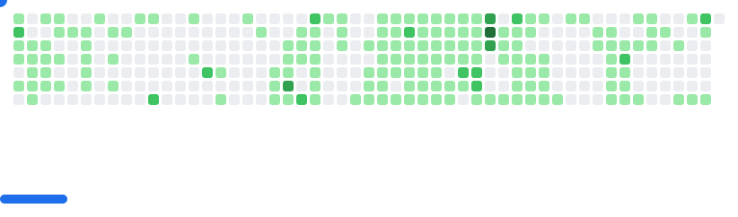

## 👋 About Me

I'm a developer passionate about creating smooth, interactive digital experiences. I turn ideas into impactful web & mobile apps.

- 🚀 Build scalable apps with React & React Native  
- 🎨 Focus on accessible, SEO-friendly UI/UX  
- ⚡ Skilled in REST API integration  
- 🛠️ Backend: NestJS, ExpressJS, Node.js, Laravel  
- 💻 Strong in JavaScript, TypeScript, HTML, CSS/SCSS  
- 🗄️ Databases: MySQL, MongoDB, PostgreSQL  
- ☁️ Cloud: AWS (S3, Cloud)  
- 🖌️ Tools: Figma  
- 🌱 Always learning — currently diving deeper into Laravel  

---

## Some Tools I've Used And Learned

  
  
  
  
  
  
  
  
  
  
  
  
  
  
  
  
  
  
  
  

---

## GitHub Stats

  <picture>
     <source media="(prefers-color-scheme: dark)" srcset="./images/breakout-dark.svg" />
      <source media="(prefers-color-scheme: light)" srcset="./images/breakout-light.svg" />
    
  </picture>

---

  
  &nbsp;
  
  &nbsp;
  
  &nbsp;
  

  <b>Let's connect! I'm open to collaboration, new ideas, and exciting opportunities.</b>

